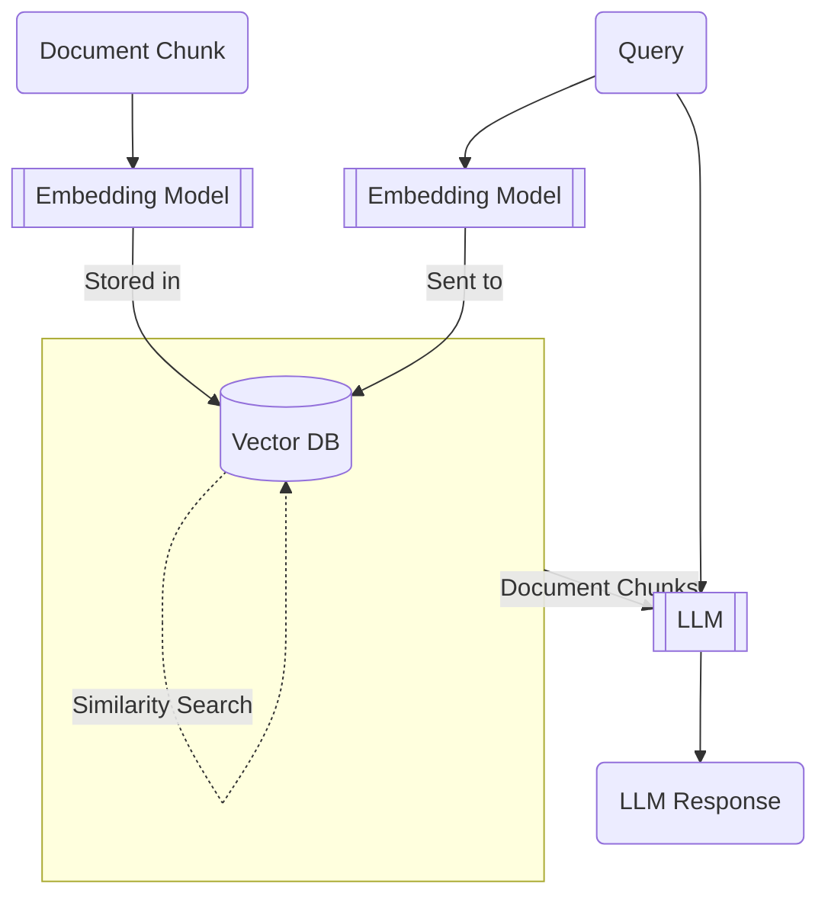
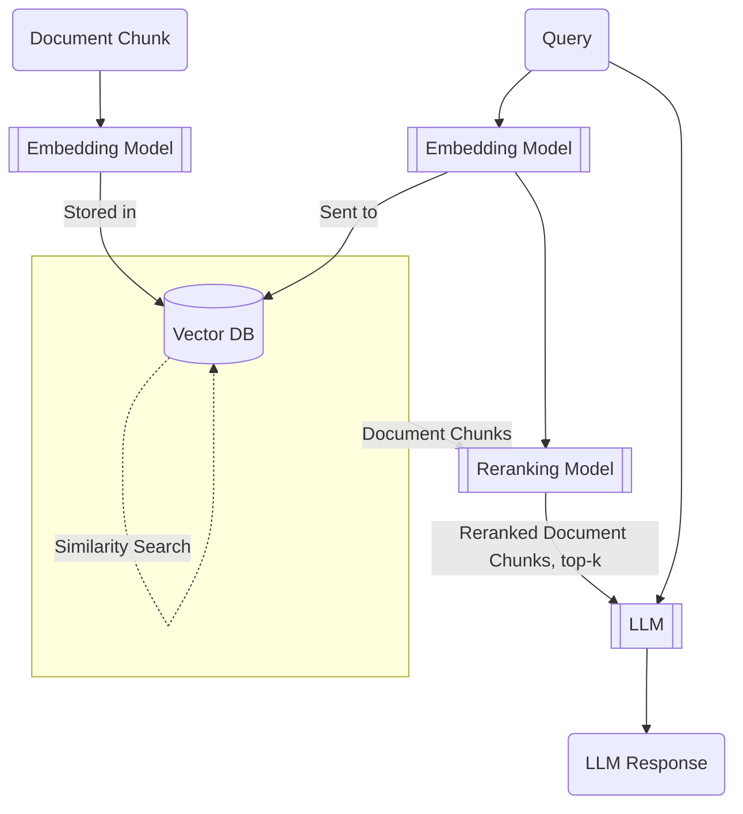

I was talking to a colleague about a RAG system he's evaluating and he mentioned that the architecture includes a reranking model. This sent me down a bit of a rabbit hole about rerankers and why reranking models make sense within the RAG architecture.

A typical RAG workflow looks like this.

Reranking models make sense when you consider these assumptions -
* LLMs have limited context windows, restricting the amount of document chunks you can pass as context with your query.
* Most LLMs have a "Missing the Needle-in-the-haystack" problem. I found the article [here](https://arize.com/blog-course/the-needle-in-a-haystack-test-evaluating-the-performance-of-llm-rag-systems/) quite insightful, but the TL;DR is that when you have a heavily stuffed context window, LLMs can miss certain details within all the noise. With RAG, that detail may have been the most important detail needed to formulate a good response.
* While Vector embeddings may live in the same (latent?) space as the actual LLMs (depends on the embedding model), the Vector similarity search is a crude approximation of what a model like an LLM can perform.

Reranking models are closer to full-fledged LLMs than they are to vector search algorithms, and are able to incorporate more nuance.

Given these assumptions, reranking can be useful because not only can you reduce the amount of context (and thus noise) passed to the LLM, but your context is now more appropriate for the query that the LLM is trying to answer.

Your workflow will now look like -

Cohere publishes benchmarks comparing what I'm calling naive RAG against workflows including their rerank model [here](https://txt.cohere.com/rerank/), if you're interested in seeing how they compare. But overall, quite an interesting rabbit hole!

